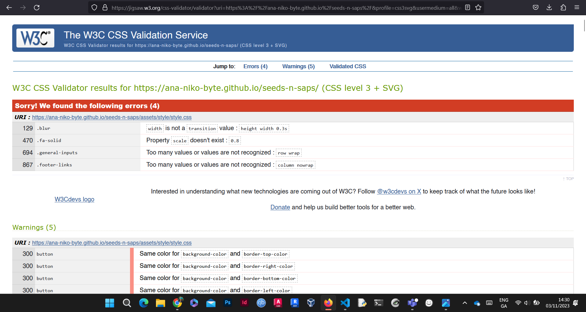

# Saplings Care Guide
[My Website](https://ana-niko-byte.github.io/seeds-n-saps/)
---

This website was created as a guide for new plant-parents, or for those who are looking at getting into plant care. This website was created purely for educational purposes. 

## Business/Social Goals: 

* To help beginners choose their first plant by automatically filtering out hard-to-look-after plants and providing them with options based on ease of care and flexibility in the environment they are to be cared for. 
* To re-assure people that plant care is not as hard as it looks, nor is it time-consuming and encourage them to take it up.
* Provide reach and build credibility for the author as a reliable and experienced source. 
* Help local plant shops and earn a small commission from links. 

## UX goals:

Home/Introduction Page: 
* As a first-time visitor, I may be already intimidated by the idea of plant-care, and want to visit a website that is
 easy to navigate, 
 easy to understand, 
 and attractive (and complies with a set colour scheme that adheres to a plant theme). 
* As a first-time visitor, I want to be encouraged and inspired by the content on the website to buy my first plant (not necessarily from the links provided in the plant cards). 
* As a recurring visitor, I want to feel confident in that the information provided is from a reliable source. 

Care/Problems Page: 
* As a first-time visitor, I want to find quick and concise guidance on problems I encounter as a first time plant parent. 
* As a first-time visitor, I want to know what is causing the problem and know how to avoid it. 
* As a recurring visitor, I want to be able to recognise common denominators in plant problems and be able to avoid them as best practice. 
* As a recurring visitor, I want to be able to send a message in case I have a problem that is not listed and be assured that my message has reached the author. 

## Structure
---
This website is composed of three separate pages, to break up the guide into digestible and easy-to-understand chunks.

The structure of the website sections is as follows: 

1. Home/Introduction Page
    * Navigation
    * Header with Title
    * Introduction to the author
    *Easy to care for plant cards with flip-on-hover functionality. These provide a short and concise intro to the plant and why they are beginner-friendly. 
    * Footer
2. Care/Problem Page
    * Navigation
    * Brief Introduction and Reassurance section on common problems plant-parents encounter. 
    * Problem cards with slide functionality. 
    First card talks about the problem. 
    Second card shows an image of the problem so users who mightn't know what the issue is can compare their plant visually. 
    Third card is a short and concise guide on ridding the problem.
    * Footer
3. Contact Page
    * Navigation
    * Contact Form
    * Footer

The navigation and footer are common across all pages, interlinking the pages and to social platforms, like github, linkedin, and instagram. 

The information is kept mostly graphical (images, icons), so that the websites is easy to understand and comparisons can be made visually. The website is designed to mitigate text information overload. 

The final page is a simple message form where users can submit any questions or queries to the author. 

## Scope of Website
---
The scope of the website is as follows: 

1. Header bar with navigation and logo. The navigation bar navigates to three different pages. 
2. An introduction band with an image and a heading for each page (unless the content is completely self-explanatory, as on the contact page). 
3. An introduction paragraph and image on the home and care pages. 
4. An image band with dynamic cards that display photos and information on:hover. 
5. Links to local locations in Ireland where these plants may be purchased, and links where relevant to commercial products that can help with certain problems beginners may encounter. 
6. A message form where users can submit their queries. 
7. Links to social medias (in this case personal, but if the website was an actual blog, these would be affiliated plant accounts). 

## Strategy
---
In order to come up with the most appropriate structure for the website, I needed to define certain factors like audience, key information, and common things users will look out for in guides on plants. 

Target Audience: 

* Beginner/ intermediate plant-parents. 
* Age category: 16+
* People with sick plants. 
* People with an interest in houseplants. 

Considerations for these users: 

* Clear, short, and concise information on best plants to buy for beginners. 
* Desirable-looking photos. 
* Quick-fixes (care page)
* Contact form for any additional queries or concerns. 

This website is designed to be self-serviced, so that users can find information quickly and be able to use it as a guideline for plantcare. The contact form is there as a plan B and a fallback for any concerns outside of this website's scope. 

As most content is viewed on phonescreens nowadays, creating a mobile-first application is a key consideration for the website's design. 

## Skeleton Frames
--- 

Note: The website has deviated slightly from this design for better responsiveness and content positioning. 

The main idea was to keep as much of the content as possible visual, so that the user (especially the first time visitor) wouldn't feel overwhelmed with information. 

The header of the home page was changed slightly as I felt the visual appeal of the built product didn't reflect the same aesthetic value as what I imagined the wireframe to represent. As such, switching to the current header layout also allowed for a more fluid responsiveness and simplicity towards user experience.  

The cards on the home and care pages provide an engaging and light solution to balancing the ratio of visual:text information. They are placed under the intro sections so users know exactly what the cards are for. 

## Aesthetics
1. Colour Palette
The colours chosen for this website were a selection of greens, dark grey and white. This was to mimick the colours of nature and tie the theme of the website to the object of focus (plants). While a shade of brown would seem like an appropriate alternative to dark grey, I felt like there wasn't enough contrast with the greens and whites, so opted for the darker option. 

2. Fonts
The _font-family_ for the website is : Arial. 

I kept things simple, and opted for one font across the entire website. This was to ensure a coherent and simple theme throughout, with headings differentiated by _color_ and _font-weight_ in CSS. 

As Arial is a sans-serif font, it is considered significantly more legible than serif, narrow, or decorative fonts. For optimal user experience, creativity is added using the above CSS properties, while keeping the typeface itself recognisable and legible. 

Arial is a built-in CSS font, so nothing needed to be embedded/downloaded. 

Alternatives considered: Verdana, Helvetica. 

## Features
---
### Responsiveness
This website is fully responsive, designed with a mobile-first approach. 

### Contrast
Text on any image background is given a color and opacity (either black or white, at 30-40% transparency). This gives the text a sufficient backdrop for legibility and contrast, while allowing the _background-image_ to seep through and create a more visually-appealing design. Text on a black background is given an off-white _color_, and text on a whte background is given a _color_ value of darkgrey (as set in the root colours in CSS), for improved legibility and contrast.  

Root colours: 

:root{
    --lightgreen: rgb(176, 227, 176);
    --darkgreen: rgb(55, 103, 55);
    --lightgrey: rgb(209, 209, 209);
    --darkgrey: rgb(34, 34, 34);
}

### Navbar
The navbar is consistent throughout the whole website, with a logo and three simple links to the other pages. On all screens over 550px (made larger as phone screens seem to be growing wider and wider these days), the navbar links are positioned in the middle of the screen, else in the far right corner with a set _margin_ value to offset it from the screen edge. 

### About
The about section is on two pages (first blocks of paragraph text on the home and care pages). 

The home page block introduces the author with an image (courtesy of Unsplash), and a personal paragraph on the author. While the information generated in the block of text is a personal account, the image is of someone else as I am not photogenic in the slightest. 

The Care about paragraph (or intro) is there to reassure the visitor that encountering problems while caring for plants is completely normal, and not to worry if they come across something unusual. It then mentions the cards below and encourages users to go view them. 

Both of these sections are designed to be simple and to-the-point. 

### Cards
The cards are key to the pages they are positioned on (home and care pages). 

On the home page, the cards provide an interactive way of introducing beginners and intermediates to possible plant options, while also hiding text from immediate view. The click me! navigation indicator gives a hint to the cards' fuctionalities, which may not be immediately obvious to users. The functionality here is a flip on:hover effect, with the image of the plant on the front, and text with a link for purchasing the plant.on the back. 

On the care page, the structure of the cards is similar, but instead has three cards positioned one on top of the other, each of which (except the middle) slide in opposite directions to reveal all three. Depending on the screen size, these cards either slide out on the X-axis (if the screen is over 900px), or on the Y-axis (if it is smaller). This ensures all content is kept legible and visible at all times. Also, since phone content tends to be oriented long-side-vertically, this kind of design made more sense. While I had considered re-using the same functionality from the home-page cards, I needed to display information in a more concise and sectioned manner.  

Links on these cards are underlined and send users to useful websites where they can purchase whatever they need to help them with their plant problem. 

### Contact Form
This form is the object of focus on the third page. This is here for users to submit their queries and concerns to the author. It is strutured with basic user-side validation using relevant and correct input types and the _required_ attribute. I had considered using HTML pattern regex, but it seemed unnecessary as all of the validation was handled by in-built functionality. This was tested several times with different inputs. 

## Technologies 
---
The website's responsive design was made possible using the following technologies: 

* HTML5 - used for structuring and content
* CSS3 - used for adding styles to the content for legibility and aesthetic appeal
* FontAwesome - used for icons 
* Firefox Developer Tools - used for debugging the website during production
* Lighthouse - An extension I used for testing the performance, accessibility, best practices and SEO of my site (result shown under debugging below). 
* GitHub - For code storage,version control and deployment
* Git - for  commiting through terminal and pushing to Github for storage. 
* VSC - The IDE I developed the project in.
* Sketches - for a clear understanding of the structure I wanted my website to follow. For future projects, I will likely use something like Balsamiq. 
* Tinypng - for compressing my images (to improve performance of my website). 
* Color Contrast Accessibility Validator - check legibility of my text on different backgrounds for better accessibility. 
* W3C Markup Validation Service - to validate my HTML for potential errors. 
* W3C CSS Validation Service - to validate my CSS code for potential errors. 
* Freeformatter CSS Beautify - to ensure I formatted my CSS correctly - I didn't copy and paste anything from here as the results looked the same as what I had already written but this served as a good check. 
* AmIResponsive - to create the responsive image. 
* Looka.com - for logo ideas (Ai tool). 

## Testing & DeBugging
---
### Testing
#### Home Page
* As a first-time visitor, I may be already intimidated by the idea of plant-care, and want to visit a website that is
 easy to navigate, 
 easy to understand, 
 and attractive (and complies with a set colour scheme that adheres to a plant theme).

Upon entering the website, the visitor is greeted with a minimalist header aesthetic - directing focus to the middle of the header where a reassuring heading - "complete care guide for beginners" - is placed. There is a simple mnavigation bar at the top of the page, which is immediately visible due to its contrasting background colour. 

* As a first-time visitor, I want to be encouraged and inspired by the content on the website to buy my first plant (not necessarily from the links provided in the plant cards). 

* As a recurring visitor, I want to feel confident in that the information provided is from a reliable source. 

The intro begins to build credibility to the author by introducing themselves, showing an image of them surrounded by plants, and mentioning growing up around houseplants. 

Further down the page, content is kept clean and concise, to make sure the visitor isn't distracted by anything unnecessary. The cards are made dynamic and interesting, following the color scheme of the site and providing 1-2 quick sentences on why a specific plant is an ideal choice for a beginner or someone looking for something non-time-consuming. 

#### Care/Problems Page: 
* As a first-time visitor, I want to find quick and concise guidance on problems I encounter as a first time plant parent. 

The intro at the top of this page reassures users that experiencing difficulties in plant care is completely normal and not to worry, and then directs users further down the page to the cards. The cards near the bottom of the page are designed similarly to those on the home page, but required more information (thus the design change from flip to translate). 

* As a first-time visitor, I want to know what is causing the problem and know how to avoid it. 

The cards slide out with the first showing a heading describing the problem and the usual cause, the second an image of the problem (from Unsplash), and the third a 'quick fix' of the problem, written clearly and concisely. 
Note: The text on these cards will likely change as it is still preliminary on this card. 

* As a recurring visitor, I want to be able to recognise common denominators in plant problems and be able to avoid them as best practice. 

This is where the icons come into place - as a first time visitor they may not be immediately recognisable (hence the text being at the top of the card), but as a recurring visitor who has likely looked through the cards simply for the dynamic layout, they may be able to quickly come to a conclusion on the possible cause simply from the icon. 

* As a recurring visitor, I want to be able to send a message in case I have a problem that is not listed and be assured that my message has reached the author. 

A contact button is provided at the bottom of the second page, and as a separate third page for any queries the user may have.

#### Contact Page 
The contact page required minimal debugging and was done by testing whether the form would submit if some of the fields were left blank (all are required), or/and if the terms and conditions checkbox was left unchecked. The code was successfully implemented and the form only submits if all fields are filled in and are in the correct format. 

### DeBugging

This is where tools like Lighthouse (extension), HTML and CSS validators, and simple responsiveness testing using the Firefox developer environment (CTRL + Shift + M) came into play. 

The project was initially built in a separate repository (the link to which will be provided below), but after my mentor informed me that my directory structure and commits needed major reformatting (and that I had been accidentally committing using my secondary account which I have since deleted), I decided to migrate all of my code into a new repository, with a more coherent directory structure, cleaner commits, and better code.

The link to this repository can be found here : [repository link](https://github.com/Ana-Niko-byte/CodeInstitute_1)

#### Build Process
I build using what I like to call 'box frames' - essentially wrapping the element I am styling with a _border_ of 1px solid red. These borders are all removed after I finish with that element's styling. While admittedly messing-looking, this allows me to see the full box model of my element and apply styles accordingly and carefully. Sometimes I do this to multiple elements at a time, as shown in the image below: 

#### Accessibility and Performance

While the scores from the Lighthouse report are quite decent, there was still some major room for improvement with regards to the overall performance of the website.

To work on this, I needed to: 
* reduce the size of my images using Tiny.png without losing out on quality - there was a potential savings of 658KiB. 
* explicitly use width and height attributes in my HTML for img instead of setting this using CSS - a classic example of just because my HTML and CSS validated as corrected, doesn't make it right or best practice. 
* serve static assets with an efficient cache policy - I wasn't entirely sure what this meant so had to research it and add it to the site. 
* ensure my links have discernible names for better accessibility - something I missed and added in later. 
* ensure my images are displayed with the correct aspect ratio as the original image (although in some cases I decided to intentially overlook this as the image served the purpose I needed it for perfectly and the aspect ratio didn't look bad at all - for best practices, I will adhere to the image ratios in future projects). 
* add a meta description for SEO

#### Image Size Reduction
I needed to reduce the size of my images to improve website performance, user experience and website speed.

#### HTML Validator
HTML validation was done using the W3C Markup Validation Service. There were a few issues found only on the second page, and were immediately addressed to resolve them.

The first image is of the errors, the rest are separate page iterations after the errors were addressed. 

#### CSS Validator
CSS Validation was done using the W3C CSS Validation Service. There were a few issues found only on the second page, and were immediately addressed to resolve them. Most of them were due to using arrows to go through the automatic list of properties, instead of typing the entire property. i.e. - flex-grow: row wrap; instead of flex-flow: row wrap; 

The first and second images show the CSS errors, the third is of a second iteration after the errors were addressed. 

### Known Bugs & Fixes 
I made sure to debug common and often missed bugs like links to socials and other websites. Everything was working correctly, but this is a good habit to have for common debugging. 

##### Root Colours
Shown are the root colours used across the website: 

:root{
    --lightgreen: rgb(176, 227, 176);
    --darkgreen: rgb(55, 103, 55);
    --lightgrey: rgb(209, 209, 209);
    --darkgrey: rgb(34, 34, 34);
}

#### Color Contrast Accessibility Validator
I also ran a contrast test using Color Contrast Accessibility Validator to see if my text and its backgrounds were legible. The results I received were a little confusing, as some of the text was read on completely different background colours than what they are actually placed on. It was only after running the site through WAVE (another accessibility checker) did I realise that the contrast problems were based on the text color and the background color property set under the images, rather than on the image color and the text. 

Here you can see a very clear contrast problem, which only worsens as the screen gets smaller. I solved this by adding a black backdrop with a set opacity so that the image didn't fully disappear and the backgrounds could work harmoniously together. This is shown in the image below.

This image was also detected as poor legibility on WAVE but I didn't initially understand why until I hovered over the heading and saw that the dark grey 'plan b' background color I set in case the image failed showed very low contrast and would result in poor legibility. The same problem extended to the subheading below the main heading. See image below. 

To fix this, I added a much lighter background color of the root lightgreen set at the top of my CSS file. There were also some issues with some of the colours on the cards, which I immediately fixed and ended up with a more cohesive color scheme across the website. 

I fixed all background colours, set var(--darkgrey) value to text colours, as specified in the root properties of my CSS stylesheet, and ran a second iteration of the colour accesibility validator and achieved a full score on legibility accessibility. 

## Deployment
---
The website is deployed on Gitpages through github, and is available for viewing in the link at the top of this README.md document. To deploy a github repository, follow the following steps: 

1. Login to your github account
2. Click on your repository section under your profile icon, and select the repository you want to deploy.
3. Once you are in your repository, click ' Settings' in the top bar. 
4. Select 'Pages' from the menu on the left. 
5. Ensure the 'Source' section is set to 'Deploy from a branch'.
6. Ensure you deploy from the main branch in your root directory. The screen should look something like this: 

7. The site you want to deploy is given a URL, available above the source section, as in the image above. It might take a while for this link to become visible and active. 

### Forking a Github Repository

If you want to make changes to your repository (or part of it) without affecting it, you can 'fork' it (make a copy of it). This ensures the original repository remains unchanged. To fork a github repository, follow the following steps: 

1. Click into the github repository you want to fork. 
2. Click 'Fork' in the top right hand side of the top bar, and this should take you to a page titled 'Create a new fork'
3. You can now work in this copy of your repository without it affecting the original. 

### Cloning a Github Repository
Cloning a repository essentially means downloading a copy of your repository that can be worked on locally. This method allows for version control and back up of code. To clone a github repository, follow the following steps: 

1. Click into the github repository you want to clone. 
2. Press the 'Code' button. This should open a section similar to the one below. 

3. Copy the link in this dropdown
4. Open a terminal within your VSC (or whatever IDE you choose to use). 
5. In the terminal type 'git clone' and paste the URL. 
6. Press Enter - you now have a cloned version of your github repository.

## Credits
---

The code written in this project was cross checked on WS3 and validated using the servcies described in the Technologies section. 

All images were taken from [Pexels](https://www.pexels.com/) and [Unsplash](https://unsplash.com/). 

Content on plant care was generated mostly from personal experience (as I've been caring for plants since I was a child), but I double checked my informaton on the following websites to make sure it was correct:

[SaferBrand](https://www.saferbrand.com/articles/leaves-foliage-problems)

[Better Homes & Gardens](https://www.bhg.com/gardening/houseplants/care/why-are-my-houseplants-leaves-turning-brown-on-the-tips/)

## Acknowledgments
---
This website was made possible through the help of my brilliant mentor, Harry Dhillon. A huge thank you to him for his support, guidance, and overall chill presence. 